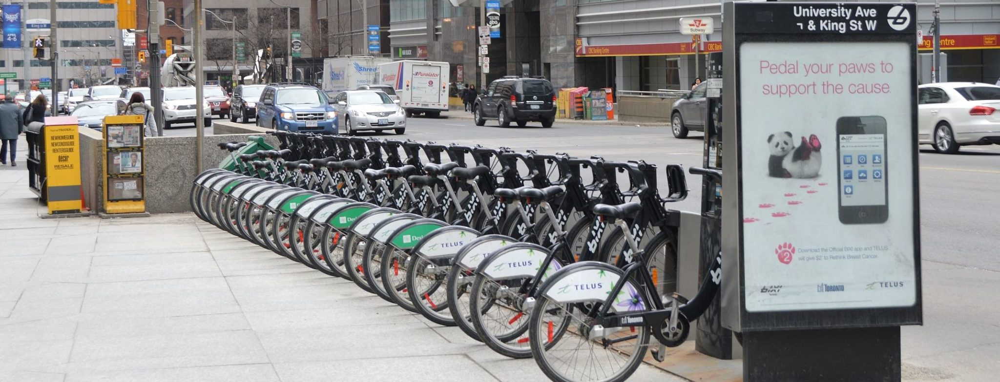
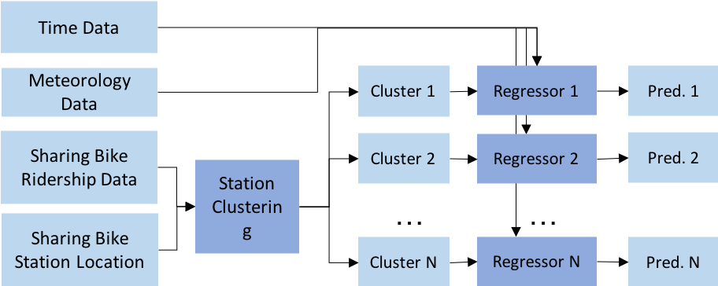
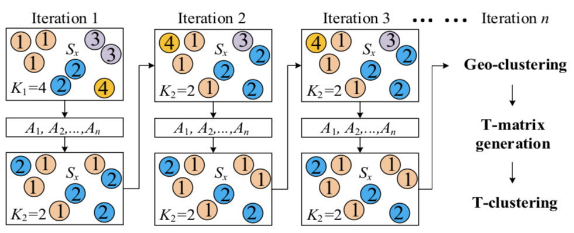
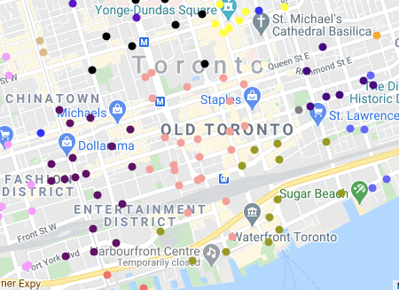
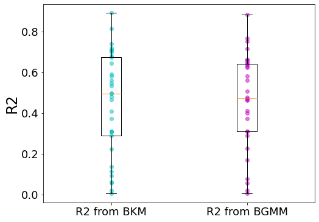
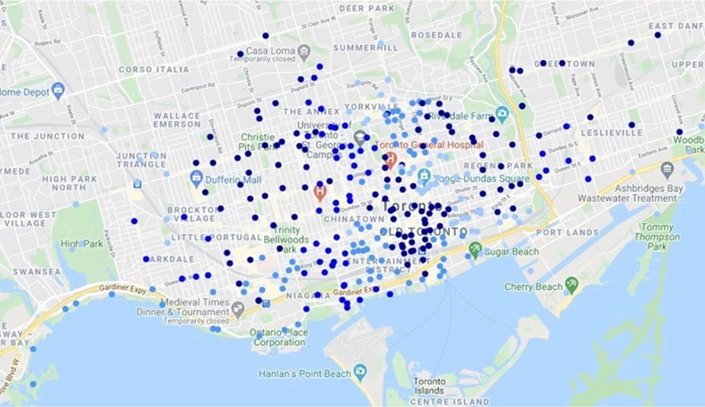

# Sharing Bike Usage Prediction in the City of Toronto

## Introduction

In order to better satisfy the cycling demand, sharing bike system operators have to continuously monitor the bike distribution across the city and reallocate bikes frequently. In this research, we develop a sharing bike usage prediction framework to support such as a re-allocation process for the City of Toronto. We first cluster the sharing bike stations according to locations and usage patterns, and then develop models to make hourly usage prediction for each cluster based on time and local climate conditions. Numerical experiments are performed to extract insights about related algorithms and the cultural and geographical layouts of the city.

## Data

* Bike Share Toronto Ridership Data: (https://open.toronto.ca/dataset/bike-share-toronto-ridership-data/)
* Canada Climate Historical Data: (https://climate.weather.gc.ca/historical_data/search_historic_data_e.html)

## Model

### Framework

In this research, we follow the paradigm of "cluster, then predict" - cluster stations into groupsand then make usage predictions at the cluster level. The framework is as follows:

### Station Clustering

We following the iterative bipartite procedure proposed by [Li, Yexin, et al. 2015](https://dl.acm.org/doi/10.1145/2820783.2820837). The proceduresare illustrated as follows:

The bipartite framework enables us to considers the pattern similarity and geographical closeness separately, ensuring that the clustering procedure will not be dominated by either one of them.

### Bike Usage Prediction

We further develop models to predict the hourly net usage (checkout−checkin) for each cluster based on the temperature, humidity, wind speed, visibility, standardized pressure, weather condition during the same hour, as well as binary variables specifying the time of the day and if the day is a weekend/holiday or not. Various models are trained and evaluated based on their R square with 3-fold cross-validation. To achieve the best performance, we implement grid search to tune hyper-parameters for each model each cluster.

## Results

### Station Clustering

The results come from the bipartite framework has better interpretability than the naive applications of the classic algorithms. The light coral group is the financial district which is one of the biggest commuting destinations for local employees, while the olive green area is more about entertainment - the Scotiabank Arena, large hotels such as Westin and Deltas are located here. The bipartite framework captures the disparities between these areas.

### Bike Usage Prediction

For the sake of simplicity, we visualize the best R square we achieve for each cluster under the two clustering methods. Despite that the mean R squares for the bipartite KMeans is slightly better than the bipartite GMM, the difference is not statistically significant. The performance of the bipartite framework is robust to the base clustering algorithm.

We observe an imbalance in prediction performance across clusters. On the following figures, the deeper blue means that the R squares are higher. For clusters that are located in the heart of downtown with high travel demand, the prediction R square could be as high as 88.98%, yet for outsider clusters, the R square is less than 10%. In terms of algorithms, the KNN and XGBoost outperform other algorithms in most cases.

